# NetBox Manager User Guide

This guide explains the day-to-day workflows in NetBox Manager. It is intended for viewers,
editors, resource administrators, and application administrators. Deployment and environment
configuration remain documented in the project [README](../README.md).

> [!WARNING]
> **Development software — use at your own risk.** NetBox Manager is under active development and
> may contain defects that cause unintended configuration changes or data loss. Before using any
> feature, create and verify current backups of every NetBox instance and other affected data, and
> make sure those backups can be restored. The data-migration feature is still under testing; test
> each migration in a non-production environment and review its dry-run plan before production use.

## 1. Roles and permissions

Your permissions come from your identity-provider groups and the access mappings configured by
an application administrator.

| Role | Typical capabilities |
|---|---|
| Viewer | Search and inspect visible resources, fleet health, drift, audit records, and templates |
| Editor | Viewer capabilities plus template editing, imports, diff previews, and ordinary pushes |
| Resource admin | Administer specifically assigned instances or GitHub targets and satisfy approval-gated pushes for assigned instances |
| App admin | Manage access mappings and create or remove NetBox instances and GitHub targets |

Resource visibility is independent of role. A high role does not reveal an instance or GitHub
target that is scoped to other groups.

## 2. Signing in

Depending on the deployment, the sign-in screen can offer:

- **Sign in with SSO** for the configured OIDC identity provider.
- **Break-glass local administrator login** for recovery when the identity provider is unavailable.

The local account is a full application administrator and should only be used for recovery.
Authentication is enforced by default. An intentionally open deployment must explicitly set
`AUTHENTICATION_DISABLED=True`; that mode also disables authorization and grants unrestricted
access to every request.

> **Screenshot placeholder:** Login screen showing SSO and local-admin options.  
> Suggested file: `docs/images/user-guide/login.png`
>
> <!-- Replace this blockquote with:  -->

After signing in, your name, effective role, groups, and sign-out button appear at the bottom of
the sidebar.

## 3. Configure NetBox instances

Open **NetBox Instances** to view the instances available to you.

### Add an instance

Application administrators can select **Add instance** and provide:

1. A unique display name.
2. The NetBox base URL, such as `https://netbox.example.com`.
3. An API token.
4. SSL verification preference.
5. Optional description and comma-separated tags.
6. Whether an approved, merged pull request is required before publishing.

Use **Test connection** before saving. The token is encrypted at rest and is never displayed
again.

### Edit an instance

Select **Edit** beside an instance you administer. The API-token field is intentionally empty;
leave it empty to retain the current token or enter a new token to rotate it. In edit mode,
**Test connection** also reuses the stored token when the field is empty.

Only application administrators can remove instances.

## 4. Configure GitHub targets

A GitHub target identifies the repository used as the source of truth for YAML files. Open
**GitHub Targets** to add or edit one.

Enter a unique name, repository in `owner/repo` form, branch, device-type path pattern,
custom-fields template path, reference-data path, and a personal access token with suitable
repository access. The reference-data path defaults to `reference-data`. Test the connection
before saving.

When editing, leave the PAT empty to retain it. Changing the repository, branch, or path changes
where future reads and writes occur; existing files are not moved automatically.

## 5. Find infrastructure objects

Use **Search** to query the visible NetBox instances for devices, virtual machines, virtual
device contexts, IP addresses, prefixes, and MAC addresses. Results are grouped by instance, so
an unreachable instance does not prevent results from healthy instances appearing.

## 6. Work with device types

Open **Device Types**, select a GitHub target, and choose an existing YAML definition or start a
new one. The editor separates base attributes and component types into tabs and shows the
resulting YAML.

### Create or edit

1. Fill in the manufacturer, model, slug, and other base attributes.
2. Add interfaces, ports, bays, and other components in their corresponding tabs.
3. Set values for any custom fields scoped to "Device type" in the **Custom Fields** tab (the
   fields themselves are defined in the shared template — see step 8).
4. Review the YAML preview.
5. Enter or review the commit message and pull-request description.
6. Save to create or update the pull request.

All saves follow the pull-request workflow. Repeated saves for a file with an open pull request
continue updating that pull request.

### Preview and publish

Before publishing, select one or more visible instances directly or by tag. Use **Preview diff**
to compare the GitHub definition with each instance, then publish when the changes are correct.

Instances marked as requiring approval accept a push only when the current file came from a
merged pull request with an approving review. An admin mapping for that specific instance is
sufficient for the admin portion of this gate.

## 7. Bulk import device types

Use **Bulk Import** to bring multiple definitions into a target repository from either a GitHub
library or a NetBox instance.

1. Select the source type and source.
2. Scan for available device types.
3. Filter and select the definitions to import.
4. Review the destination target and pull-request details.
5. Import the selection.

The selected files are submitted in one shared branch and pull request. Existing destination
files are skipped rather than overwritten. Publishing imported files to NetBox is a separate
step after review and merge.

## 8. Manage custom fields

The **Custom Fields** page manages the target's shared custom-fields YAML template. You can edit
custom fields and choice sets, import selected differences from a NetBox instance, preview drift,
and push the template to selected instances.

Choice sets are published before fields because fields may reference them. Existing fields are
changed only when overwrite is selected.

A custom field's **content types** determine where it can be used. Give it "Device type"
(`dcim.devicetype`) to make it available as a value on device types in the editor — see step 6.

## 9. Manage reference data

Open **Reference Data**, choose a GitHub target, and select a kind: manufacturers, tags, config
templates, export templates, device roles, platforms, webhooks, event rules, or config contexts.
Each kind is stored in its own YAML file under the target's reference-data path, which defaults to
`reference-data/`. Use either the schema-generated form or YAML view; saving opens a new pull
request or updates the existing one.

You can import a kind from a visible NetBox instance, preview differences, and push it to selected
instances. Pushes create missing objects, update existing objects only when **Overwrite** is
selected, follow dependency order, and never delete objects. The same resource-scoped roles and
approved-PR gate used by Custom Fields apply here. Reference-data comparison is currently
on-demand; it is not part of scheduled drift checks.

Keep these safety rules in mind:

- Data-source-synced objects and fields are omitted.
- Webhook secrets are never exported. Sensitive header values appear as `<redacted>` and are
  skipped during push; webhook URLs containing user information or query strings are rejected.
- New event rules remain disabled unless **Enable new event rules** is selected for the push.
- Config-context assignments support sites, roles, platforms, device-type slugs, tags, and tenants.
  Assignment types that cannot be resolved reliably by name are omitted.

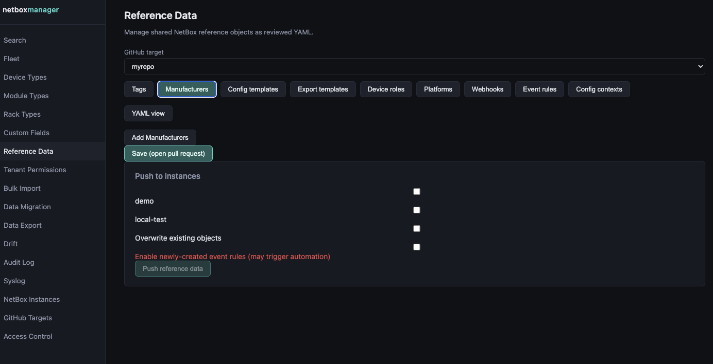

## 10. Monitor fleet health and drift

Use **Fleet** to check NetBox reachability, versions, installed plugins, response time, and
available token-expiry information. Resolve connectivity or credential warnings before a large
publish operation.

Use **Drift** to see device types and custom-fields templates that differ from their GitHub source.
This covers device types NetBox Manager has pushed before, and also device types that were created
directly in a NetBox instance by hand — as long as their manufacturer and slug match something
already committed to the repo, they're picked up automatically. Select **Check all now** for an
on-demand refresh; otherwise the background schedule refreshes the data periodically when enabled
by the administrator.

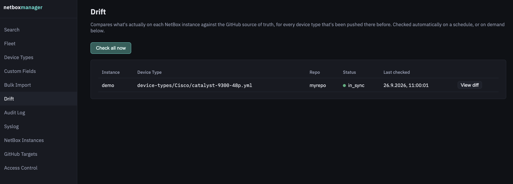

## 11. Migrate data between NetBox instances

> [!CAUTION]
> **Data migration is still under testing.** It writes directly to the target NetBox instance and
> rollback is best-effort: updated objects are not restored automatically. Back up the source and
> target instances, verify that the backups are usable, and test the migration outside production
> before proceeding. Use this feature at your own risk.

Open **Data Migration**, choose the source and target instances, then select the object types and
tenant scope to migrate. Use **Preview migration (dry run)** first: the plan shows which objects
will be created, updated, mapped, skipped, or require manual resolution. Review ambiguous matches
and conflict-policy overrides before confirming execution.

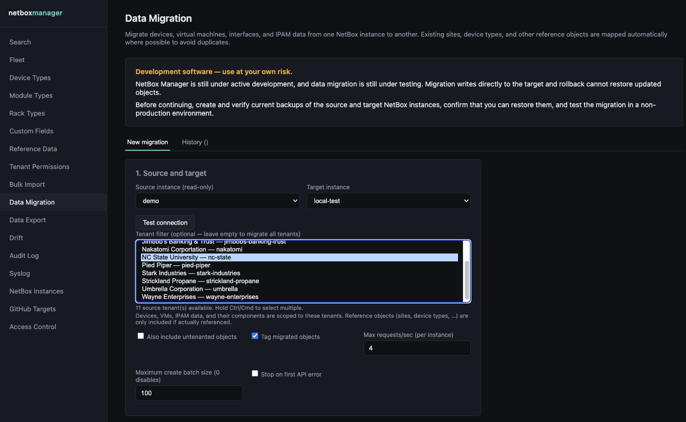

The available infrastructure types include power panels and feeds, providers and circuits,
circuit terminations, L2VPNs and their interface/VLAN terminations, virtual device contexts
(VDCs), and cables. Dependencies are included automatically. VDCs are created after their device
and before its interfaces, so each interface's VDC assignments can be written in the same request.
VDC primary IPs are applied afterward. Cable endpoint objects are migrated before their cables;
cables are matched by their resolved endpoint sets rather than by their optional label. With a
tenant filter, otherwise-tenantless cables attached to an in-scope device are included as well.
If such a cable terminates on an object explicitly owned by another tenant, that dependency chain
and the cable are excluded; the migration will not pull a foreign tenant's circuit into scope.

VLAN matching first compares VID and VLAN group, then VID and site. If a broad lookup matches more
than one target VLAN, planning continues with the more specific strategy. If it is still ambiguous,
an exact, unique match of the VLAN's assigned prefix set is used. Anything less certain remains in
**Mapping review** for an explicit choice.

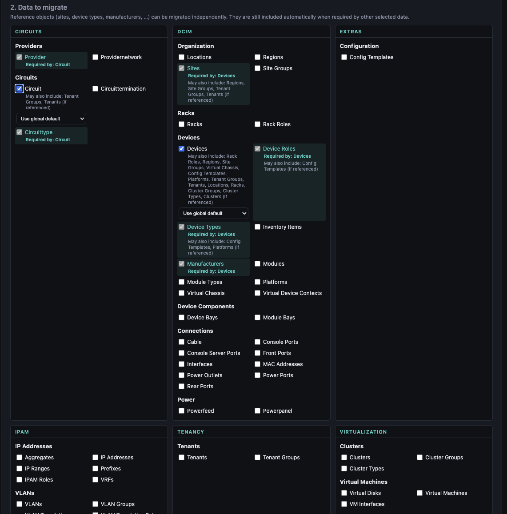

After planning, the execution controls are shown above the plan summary. Review the plan below,
return to the top, select the confirmation checkbox, and choose **Run migration**. The same top
control area shows **Cancel**, retry, rollback, and start-over actions when applicable.

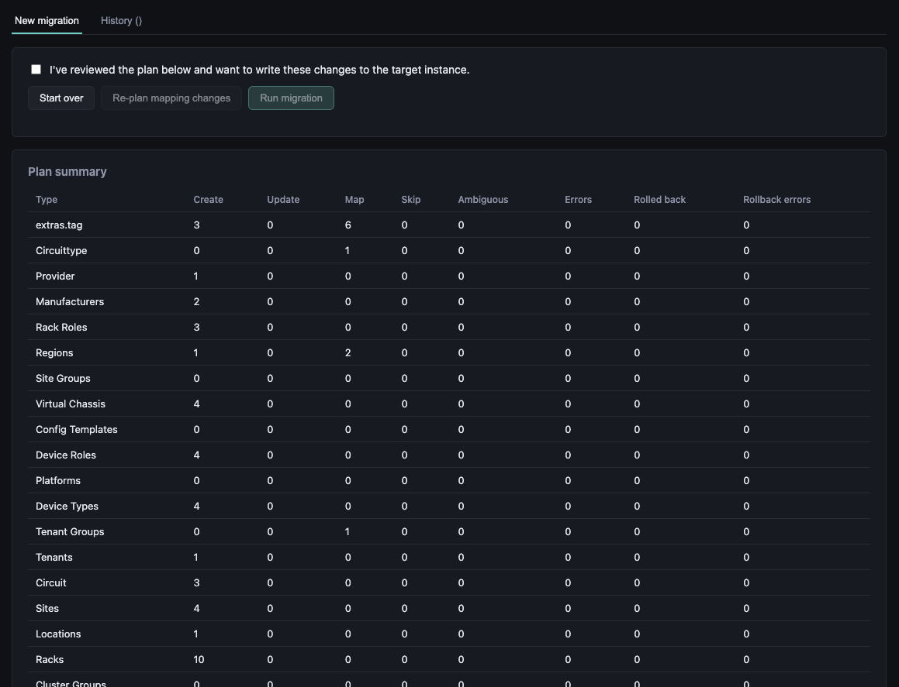

There might be errors and warnings:

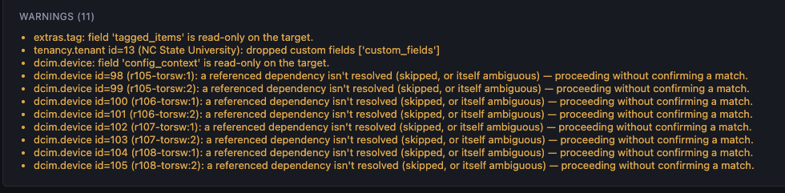

The mapping to existing obejcts can be viewed and also corrected.

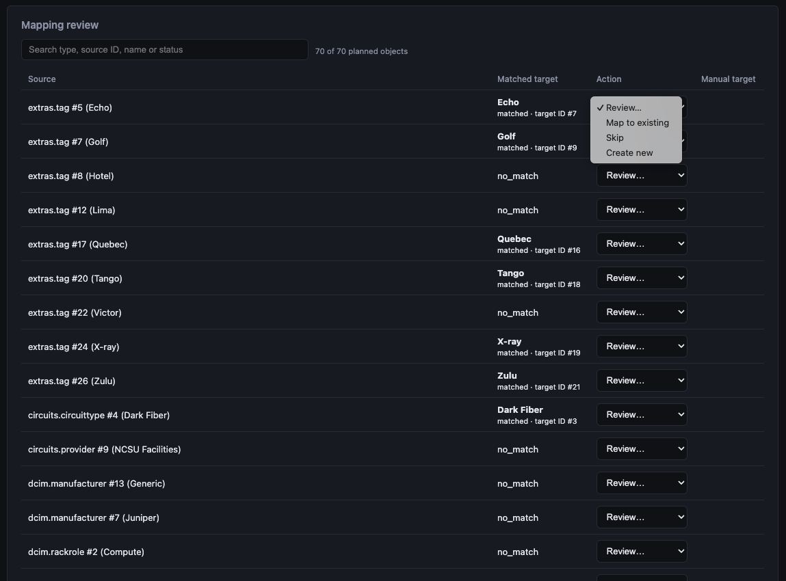

For missing mappings a mapping can be added manually.

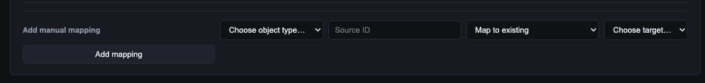

A report of the migration plan can be downloaded to dcoumentation or review.

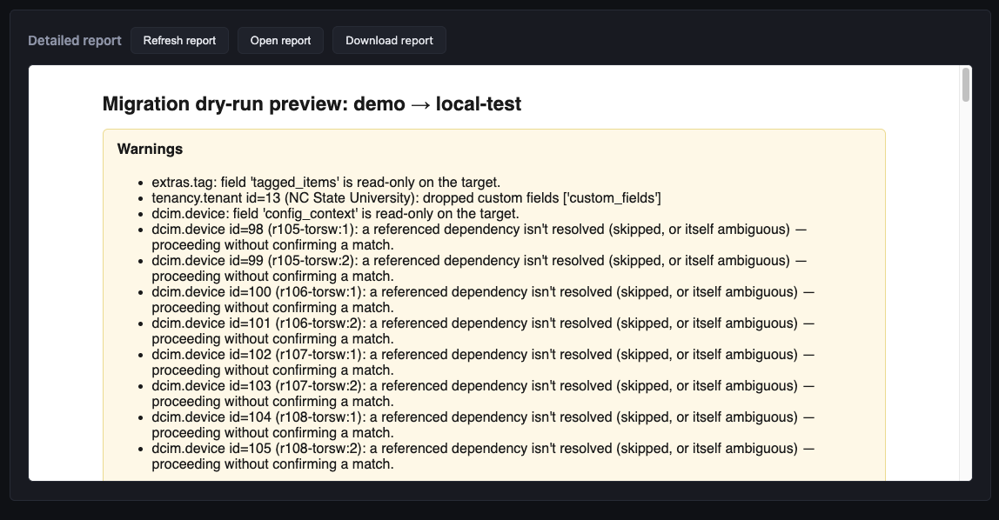

When **Tag migrated objects** is enabled, the migration creates or reuses two tags on the target
before migrating any data:

- `migrated-from-<source>-created` marks objects created by the migration.
- `migrated-from-<source>-changed` marks existing objects changed by the migration.

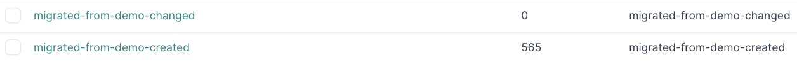

The appropriate tag is included in the object's original create or update request. Existing tags
from the migration payload are preserved, and mapped or skipped objects are not tagged. If either
marker tag cannot be prepared, execution continues and the job records a warning. A rollback
deletes only successfully created objects; it does not restore updated objects and retains both
marker-tag definitions.

When the review is completed the migration can be started.

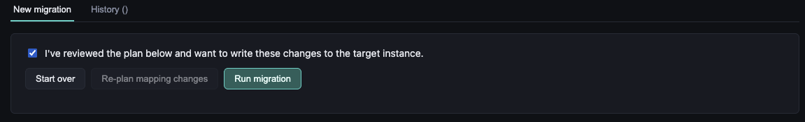

After the migration the is completed the table and the report will be updated:

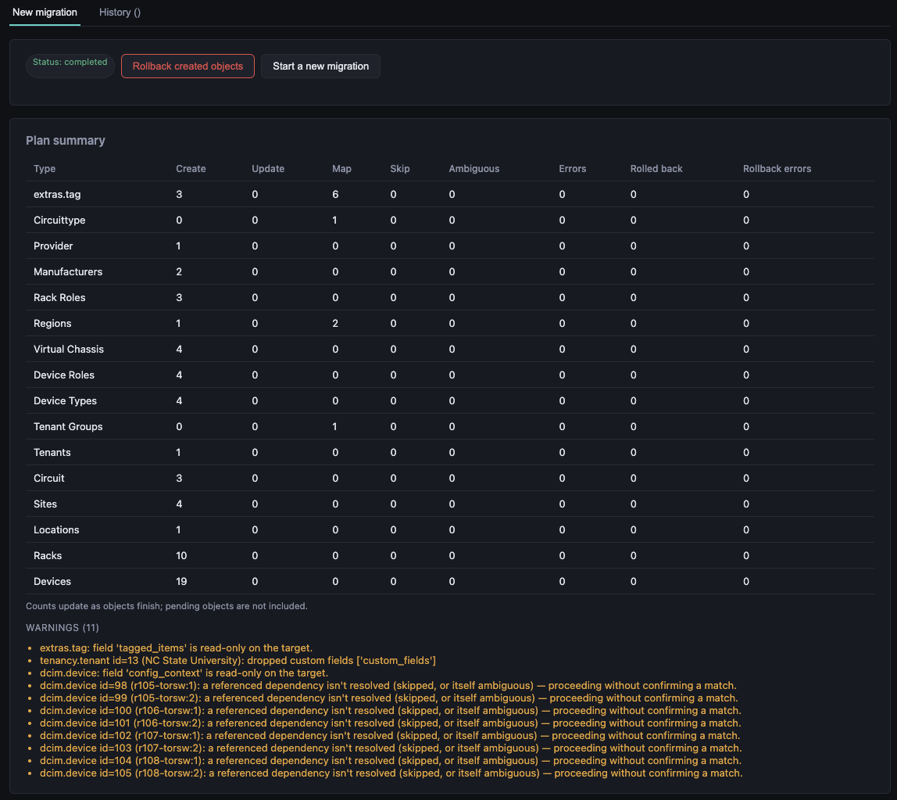

## 12. Export tenant data

Open **Data Export**, choose one visible NetBox instance and tenant, then select Devices, Virtual
Device Contexts, and/or Virtual Machines. Fixed identity fields are always included. Optional
standard fields and every applicable custom field are discovered from the selected instance. Use
the custom-field filter for long lists, then choose CSV or Excel and select **Start export**.

CSV uses UTF-8 with a BOM and supports comma or semicolon delimiters. Multiple selected object
types are packaged as separate CSV files in a ZIP. Excel produces one worksheet per object type.
All cells are protected against spreadsheet-formula injection. Region means the site's directly
assigned region; parent-region ancestry is not expanded.

Jobs run in the background and are visible only to their creator. The Jobs tab shows progress,
completion, and expiry; it also provides download, cancellation, and deletion actions when they
apply. Files expire seven days after completion by default, jobs do not resume after an application
restart, and administrator-configured row, concurrency, and disk-space limits may reject or stop a
large export. Authentication-disabled deployments share the owner `anonymous`, so all users of that
open deployment share its jobs.

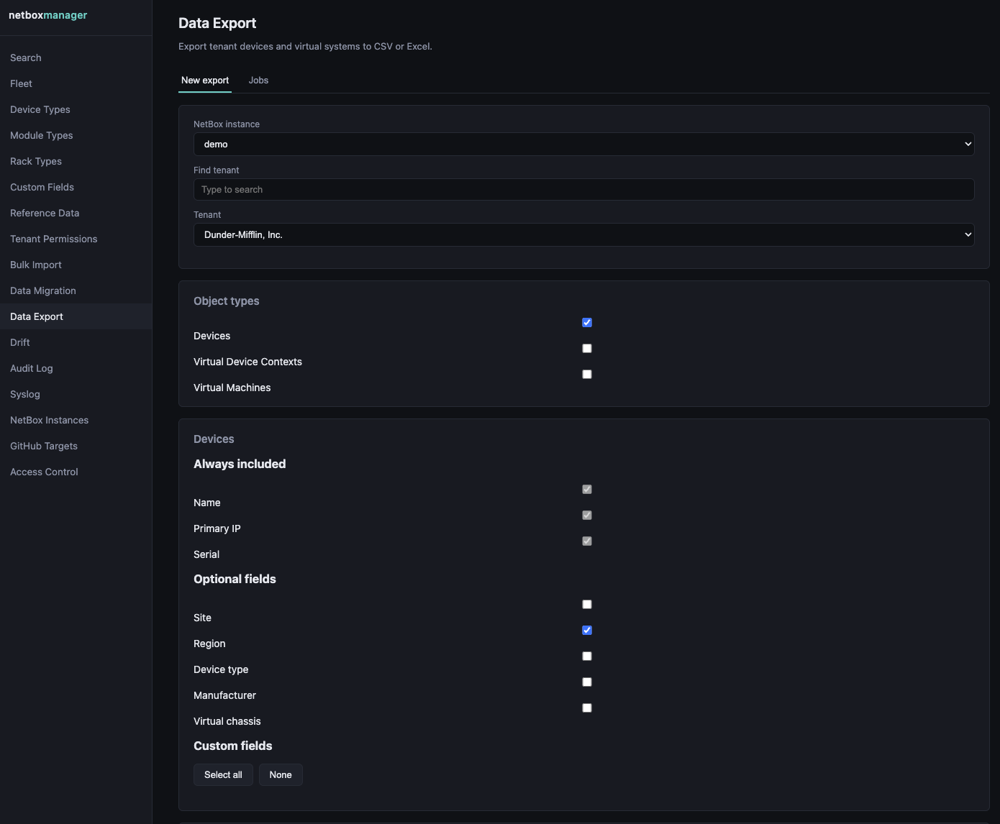

## 13. Review audit and syslog status

The **Audit Log** records GitHub saves and NetBox pushes, including the actor, target, status, and
details. Failed and rejected actions are retained as well as successful actions.

The **Syslog** page shows the configured forwarding destination and can send a test message. Its
settings are read-only in the UI and must be changed through deployment configuration.

## 14. Manage access mappings

This page is visible only to application administrators. Each row maps one OIDC group to a role
and a scope:

- **All resources** grants the role globally but does not override resource visibility rules.
- **NetBox instance** or **GitHub target** scopes the row to one resource and makes that group one
  of the groups allowed to see it.
- **Use default role** creates a visibility-only grant for a concrete resource.

A resource with no concrete mappings is visible to everyone. Adding its first concrete mapping
makes it visible only to groups mapped to that resource. Keep at least one permanent bootstrap
admin group configured so administrators can recover from mapping mistakes.

## 15. Common problems

| Symptom | What to check |
|---|---|
| A resource is missing | Your group may not have a visibility mapping for that resource |
| Edit or create returns 403 | Creating/removing needs app admin; editing needs app admin or admin on that resource |
| Test connection fails | Confirm URL/repository, token permissions, SSL trust, and network reachability |
| Approval-gated publish is blocked | Confirm the current content came from a merged PR with an approving review |
| A reference-data object was not updated | Select **Overwrite**; pushes create missing objects but preserve existing ones by default |
| A reference-data webhook value is missing | Secrets and redacted headers are deliberately omitted; enter them directly in NetBox |
| An export will not start or complete | Check the per-user/concurrent-job limits, row cap, free space in the export volume, and NetBox connectivity |
| A token field is blank while editing | This is expected; leave it blank to keep the stored secret |
| GitHub files appear to have moved after editing a target | Changing repo/branch/path changes the lookup location but does not move existing files |
| Local login returns 429 | Wait for the five-minute per-process failure window or restart the single backend process |

For deployment-level failures, see [Troubleshooting in the README](../README.md#troubleshooting).
