# NetBox Manager User Guide

This guide explains the day-to-day workflows in NetBox Manager. It is intended for viewers,
editors, resource administrators, and application administrators. Deployment and environment
configuration remain documented in the project [README](../README.md).

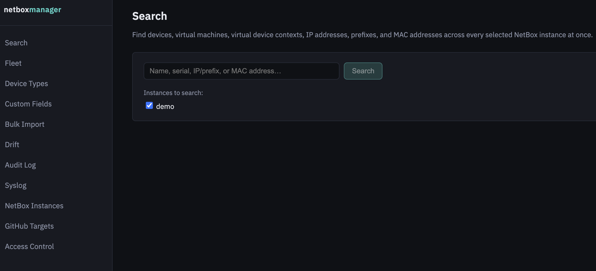

## 1. Roles and permissions

Your permissions come from your identity-provider groups and the access mappings configured by
an application administrator.

| Role | Typical capabilities |
|---|---|
| Viewer | Search and inspect visible resources, fleet health, drift, audit records, and templates |
| Editor | Viewer capabilities plus template editing, imports, diff previews, and ordinary pushes |
| Resource admin | Administer specifically assigned instances or GitHub targets and satisfy approval-gated pushes for assigned instances |
| App admin | Manage access mappings and create or remove NetBox instances and GitHub targets |

Resource visibility is independent of role. A high role does not reveal an instance or GitHub
target that is scoped to other groups.

## 2. Signing in

Depending on the deployment, the sign-in screen can offer:

- **Sign in with SSO** for the configured OIDC identity provider.
- **Break-glass local administrator login** for recovery when the identity provider is unavailable.

The local account is a full application administrator and should only be used for recovery.

> **Screenshot placeholder:** Login screen showing SSO and local-admin options.  
> Suggested file: `docs/images/user-guide/login.png`
>
> <!-- Replace this blockquote with:  -->

After signing in, your name, effective role, groups, and sign-out button appear at the bottom of
the sidebar.

## 3. Configure NetBox instances

Open **NetBox Instances** to view the instances available to you.

### Add an instance

Application administrators can select **Add instance** and provide:

1. A unique display name.
2. The NetBox base URL, such as `https://netbox.example.com`.
3. An API token.
4. SSL verification preference.
5. Optional description and comma-separated tags.
6. Whether an approved, merged pull request is required before publishing.

Use **Test connection** before saving. The token is encrypted at rest and is never displayed
again.

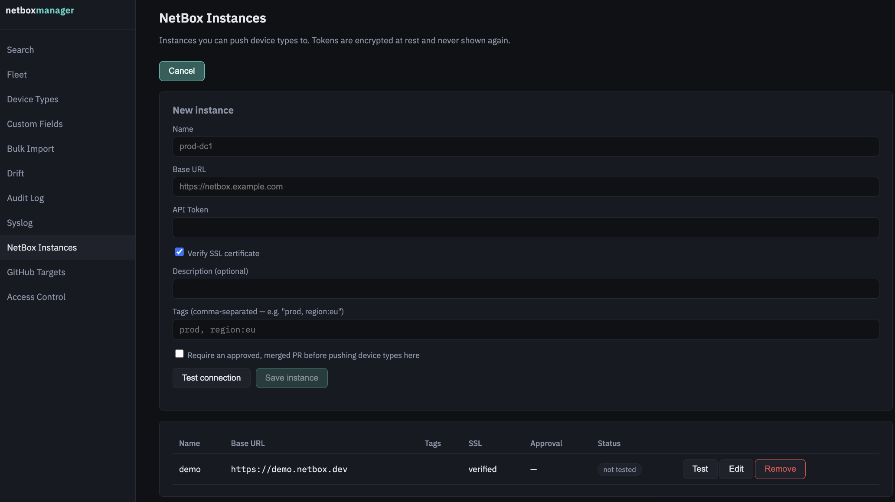

### Edit an instance

Select **Edit** beside an instance you administer. The API-token field is intentionally empty;
leave it empty to retain the current token or enter a new token to rotate it. In edit mode,
**Test connection** also reuses the stored token when the field is empty.

Only application administrators can remove instances.

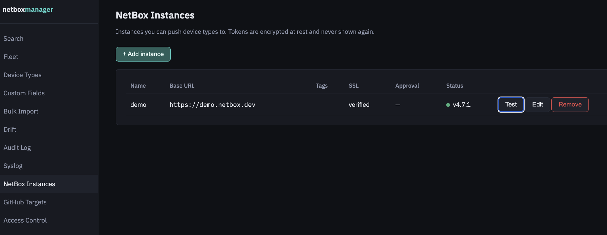

## 4. Configure GitHub targets

A GitHub target identifies the repository used as the source of truth for YAML files. Open
**GitHub Targets** to add or edit one.

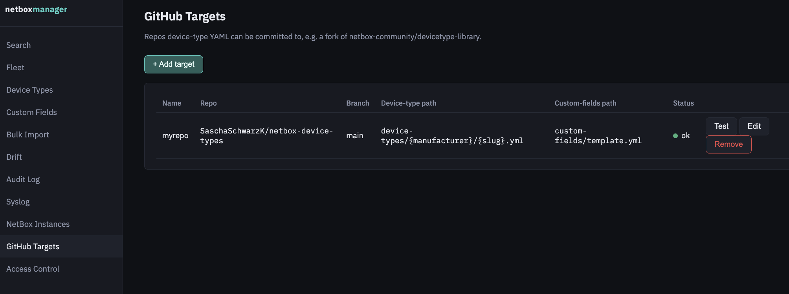

Enter a unique name, repository in `owner/repo` form, branch, device-type path pattern,
custom-fields template path, and a personal access token with suitable repository access. Test
the connection before saving.

When editing, leave the PAT empty to retain it. Changing the repository, branch, or path changes
where future reads and writes occur; existing files are not moved automatically.

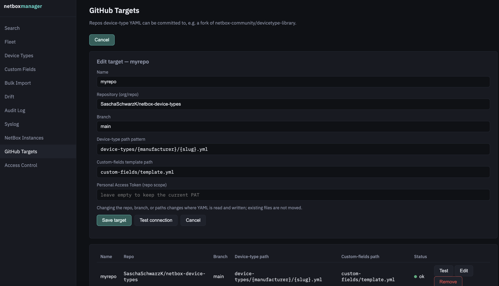

## 5. Find infrastructure objects

Use **Search** to query the visible NetBox instances for devices, virtual machines, virtual
device contexts, IP addresses, prefixes, and MAC addresses. Results are grouped by instance, so
an unreachable instance does not prevent results from healthy instances appearing.

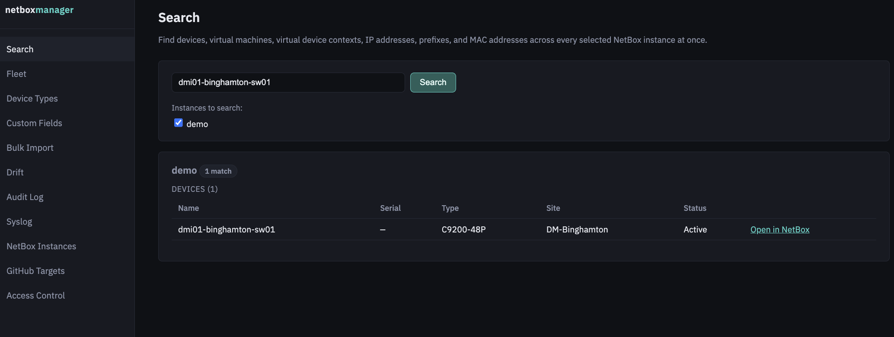

## 6. Work with device types

Open **Device Types**, select a GitHub target, and choose an existing YAML definition or start a
new one. The editor separates base attributes and component types into tabs and shows the
resulting YAML.

### Create or edit

1. Fill in the manufacturer, model, slug, and other base attributes.
2. Add interfaces, ports, bays, and other components in their corresponding tabs.
3. Set values for any custom fields scoped to "Device type" in the **Custom Fields** tab (the
   fields themselves are defined in the shared template — see step 8).
4. Review the YAML preview.
5. Enter or review the commit message and pull-request description.
6. Save to create or update the pull request.

All saves follow the pull-request workflow. Repeated saves for a file with an open pull request
continue updating that pull request.

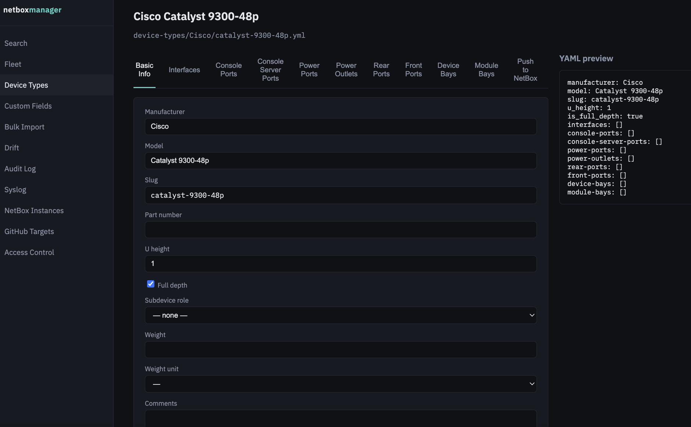

### Preview and publish

Before publishing, select one or more visible instances directly or by tag. Use **Preview diff**
to compare the GitHub definition with each instance, then publish when the changes are correct.

Instances marked as requiring approval accept a push only when the current file came from a
merged pull request with an approving review. An admin mapping for that specific instance is
sufficient for the admin portion of this gate.

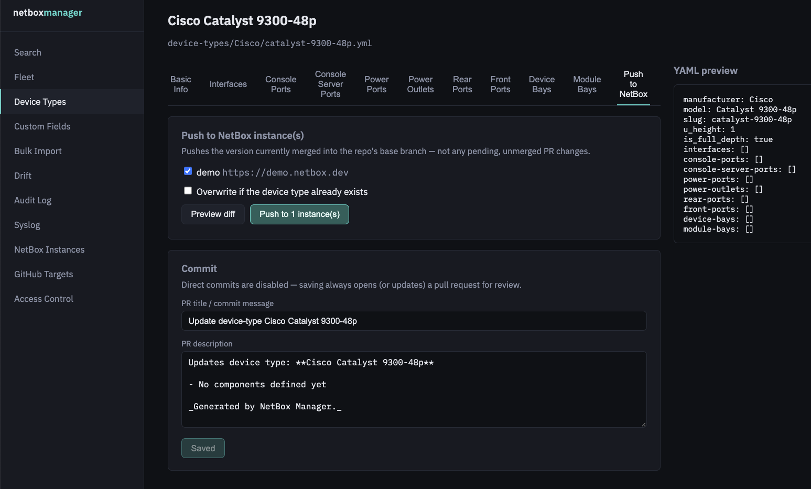

## 7. Bulk import device types

Use **Bulk Import** to bring multiple definitions into a target repository from either a GitHub
library or a NetBox instance.

1. Select the source type and source.
2. Scan for available device types.
3. Filter and select the definitions to import.
4. Review the destination target and pull-request details.
5. Import the selection.

The selected files are submitted in one shared branch and pull request. Existing destination
files are skipped rather than overwritten. Publishing imported files to NetBox is a separate
step after review and merge.

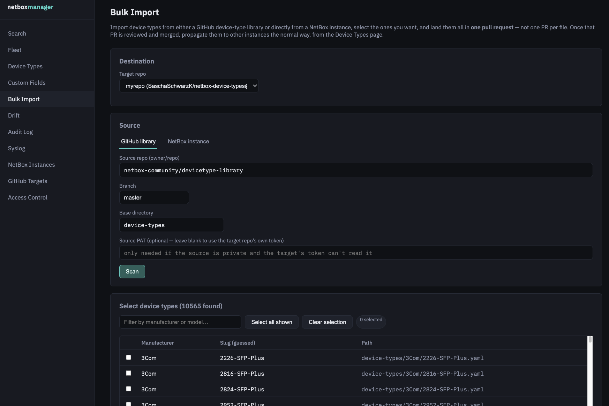

## 8. Manage custom fields

The **Custom Fields** page manages the target's shared custom-fields YAML template. You can edit
custom fields and choice sets, import selected differences from a NetBox instance, preview drift,
and push the template to selected instances.

Choice sets are published before fields because fields may reference them. Existing fields are
changed only when overwrite is selected.

A custom field's **content types** determine where it can be used. Give it "Device type"
(`dcim.devicetype`) to make it available as a value on device types in the editor — see step 6.

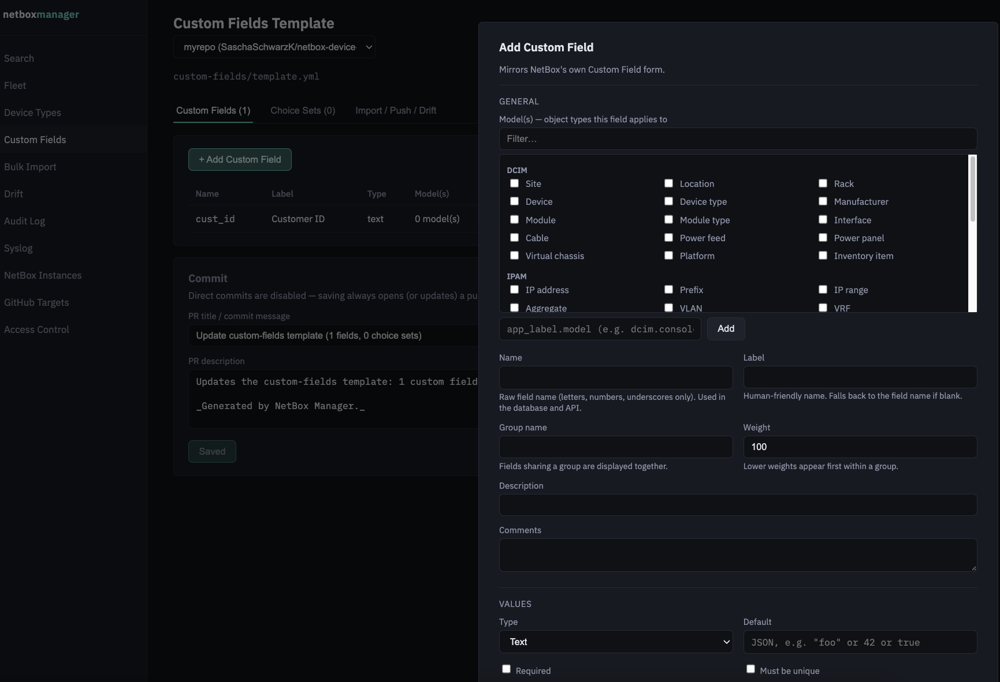

## 9. Monitor fleet health and drift

Use **Fleet** to check NetBox reachability, versions, installed plugins, response time, and
available token-expiry information. Resolve connectivity or credential warnings before a large
publish operation.

Use **Drift** to see device types and custom-fields templates that differ from their GitHub source.
This covers device types NetBox Manager has pushed before, and also device types that were created
directly in a NetBox instance by hand — as long as their manufacturer and slug match something
already committed to the repo, they're picked up automatically. Select **Check all now** for an
on-demand refresh; otherwise the background schedule refreshes the data periodically when enabled
by the administrator.

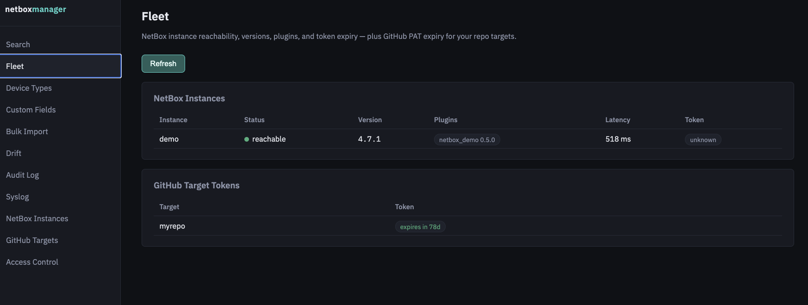

[Drift results](images/user-guide/drift.png)

## 10. Review audit and syslog status

The **Audit Log** records GitHub saves and NetBox pushes, including the actor, target, status, and
details. Failed and rejected actions are retained as well as successful actions.

The **Syslog** page shows the configured forwarding destination and can send a test message. Its
settings are read-only in the UI and must be changed through deployment configuration.

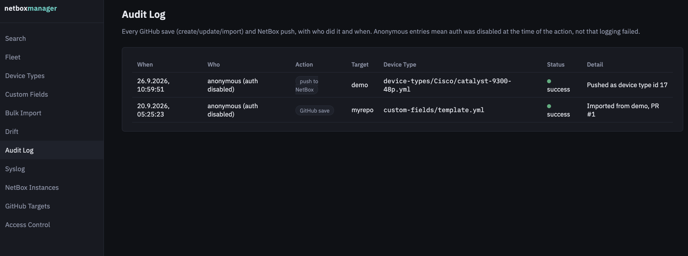

## 11. Manage access mappings

This page is visible only to application administrators. Each row maps one OIDC group to a role
and a scope:

- **All resources** grants the role globally but does not override resource visibility rules.
- **NetBox instance** or **GitHub target** scopes the row to one resource and makes that group one
  of the groups allowed to see it.
- **Use default role** creates a visibility-only grant for a concrete resource.

A resource with no concrete mappings is visible to everyone. Adding its first concrete mapping
makes it visible only to groups mapped to that resource. Keep at least one permanent bootstrap
admin group configured so administrators can recover from mapping mistakes.

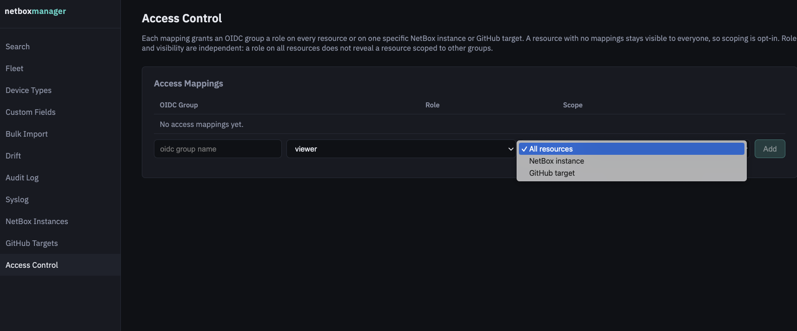

## 12. Common problems

| Symptom | What to check |
|---|---|
| A resource is missing | Your group may not have a visibility mapping for that resource |
| Edit or create returns 403 | Creating/removing needs app admin; editing needs app admin or admin on that resource |
| Test connection fails | Confirm URL/repository, token permissions, SSL trust, and network reachability |
| Approval-gated publish is blocked | Confirm the current content came from a merged PR with an approving review |
| A token field is blank while editing | This is expected; leave it blank to keep the stored secret |
| GitHub files appear to have moved after editing a target | Changing repo/branch/path changes the lookup location but does not move existing files |
| Local login returns 429 | Wait for the five-minute per-process failure window or restart the single backend process |

For deployment-level failures, see [Troubleshooting in the README](../README.md#troubleshooting).
